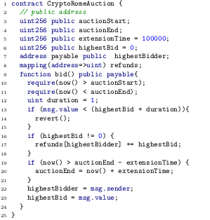
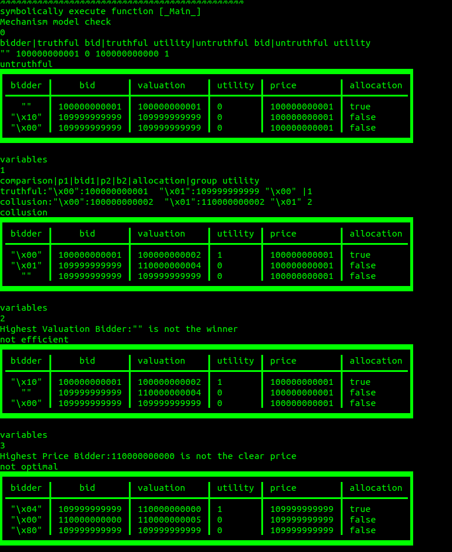
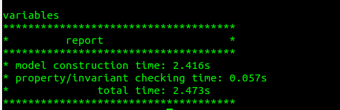

# README

### Quick Start

#### 1. pull from docker registry

```bash
docker pull liuyedocker/fse2020-faircon
```

#### 2. run demo case

```bash
docker run --name faircon -it liuyedocker/fse2020-faircon
```

#### 3. run experiments for all cases

```
docker run --name faircon -it liuyedocker/fse2020-faircon bash scripts/run_experiment.sh
```
<!-- 
###  Customization

#### 1. build docker image

in the same directory, execute the following command.
```
    docker build  . -t  fse2020-faircon 
```

#### 2. run demo case

```bash
docker run --name faircon -it fse2020-faircon
```

#### 3. run experiments for all cases

```
docker run --name faircon -it fse2020-faircon bash scripts/run_experiment.sh
``` -->

###  Verification and Validation Process

Taking cryptoRomeAuction as an example,  

#### 1. Instrumented harness contracts
Below is an example harness program for the contract cryptoRomeAuction.sol. 

" \__Main__" is  the entry function where symbolic execution starts. There are three bidders specified by "(msg_senderX, msg_valueX, pX)".  Assumptions on them are specified using the "declare_assumption" function. After calling the "bid()" functions,  allocation and clear price are declared using "declare_allocation" and "declare_clearprice", respectively. For simplicity, the bidders' utility patterns are explicitly declared with "declare_utility". At the end, four fairness properties are supplied using "declare_check".


to


#### 2.let's run the demo case.
```bash
docker run --name faircon -it liuyedocker/fse2020-faircon
```
The log would be :



Aboved shows the sample output: four counterexamples are found against the Truthfulness, Collusion-freeness, Optimality and Efficiency.  The time spent on model extraction and property checking are also included in the report.

#### 3. analyze the truthfulness property shown in log

__truthfulness : NO__
```
   bidder "" can get more utility by cheating in the auction
```
|bidder|truthful bid|truthful utility|untruthful bid|untruthful utility|
|----------------------|-----------------|-------------|----------|---------|
|""| 100000000001| 0| 100000000000| 1|


__existing  truthful scenario__:

| bidder   |    bid      | valuation    | utility  | price        | allocation |
|----|----|----|----|--|---|
|""  | 100000000001 | 100000000001 | 0       | 100000000001 | true       |
|"\x10" | 109999999999 | 109999999999 |  0       | 100000000001 | false      |
| "\x00" | 109999999999 | 109999999999 | 0       | 100000000001 | false   |
