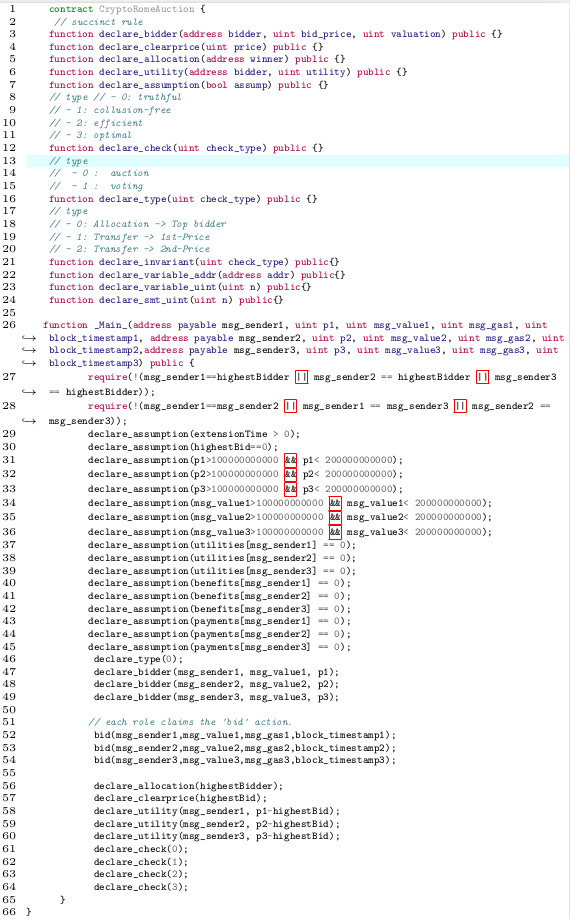

# README

### Quick Start

#### 1. Pull from docker registry

```bash
docker pull liuyedocker/fse2020-faircon
```

#### 2. Run demo case

```bash
docker run --name faircon -it liuyedocker/fse2020-faircon
```

#### 3. Run experiments for all cases

```
docker run --name faircon -it liuyedocker/fse2020-faircon bash scripts/run_experiment.sh
```
<!-- 
###  Customization

#### 1. Build Docker image

in the same directory, execute the following command.
```
    docker build  . -t  fse2020-faircon 
```

#### 2. Run the demo case

```bash
docker run --name faircon -it fse2020-faircon
```

#### 3. Run experiments for all cases

```
docker run --name faircon -it fse2020-faircon bash scripts/run_experiment.sh
``` -->

###  Verification and Validation Process

#### 1. Instrument harness contracts

Below is an example harness program generated for the contract `cryptoRomeAuction.sol`. 

* The function `__Main__` is the entry point where the symbolic execution starts. 
* There are three bidders specified with the format  `(msg_senderX, msg_valueX, pX)` using `declare_bidder`.  
* Assumptions about bidders are specified using `declare_assumption`. 
* After calling `bid()`, allocation and clear price are declared with `declare_allocation` and `declare_clearprice`, respectively.
* The bidders' utility functions are explicitly declared with `declare_utility`. 
* Finally, four fairness properties are supplied with `declare_check`.


to



#### 2. Run the demo case with Docker

```bash
docker run --name faircon -it liuyedocker/fse2020-faircon
```

The console log should look like the following:


* Aboved shows the sample output: 
    - Four counterexamples are found against the Truthfulness, Collusion-freeness, Optimality, and Efficiency properties.  
    - The time spent on model extraction and property checking are also included in the report.

#### 3. What the log says

* *Is the contract truthful?* **NO**
    * Reason: *bidder "" can get more utility by not acting truthfully in the auction.*

|Bidder|Truthful bid|Truthful utility|Untruthful bid|Untruthful utility|
|----------------------|-----------------|-------------|----------|---------|
|""| 100000000001| 0| 100000000000| 1|

* In contrast, a truthful bid look like this:

| Bidder   |    Bid      | Valuation    | Utility  | Price        | Allocation |
|----|----|----|----|--|---|
|""  | 100000000001 | 100000000001 | 0       | 100000000001 | true       |
|"\x10" | 109999999999 | 109999999999 |  0       | 100000000001 | false      |
| "\x00" | 109999999999 | 109999999999 | 0       | 100000000001 | false   |
